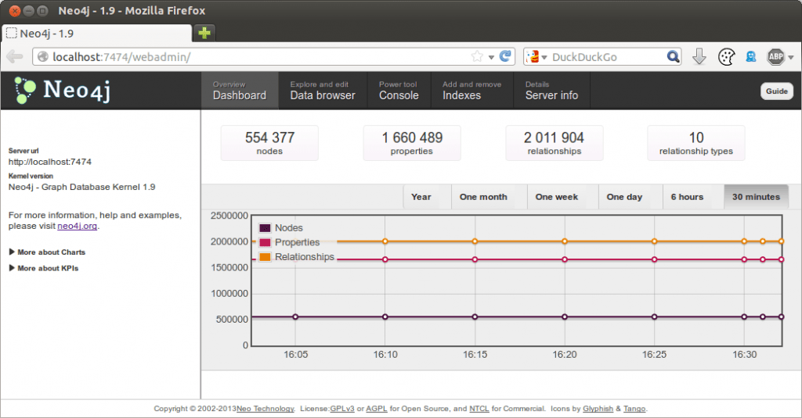
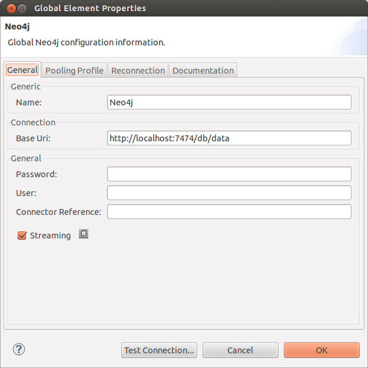
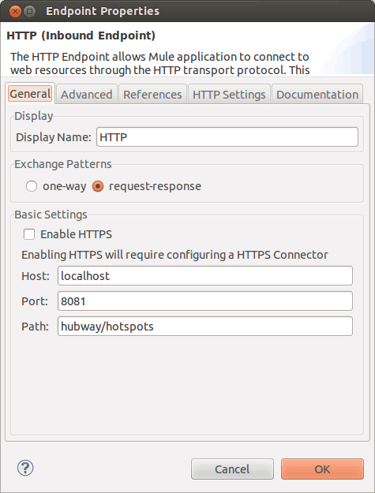
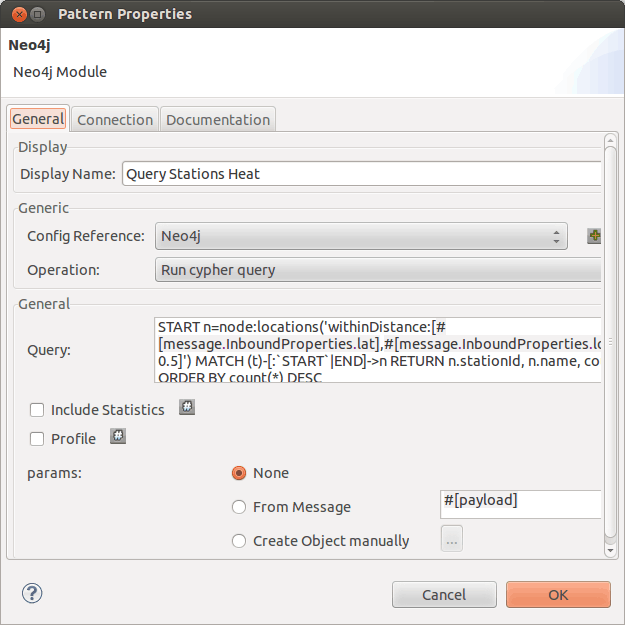
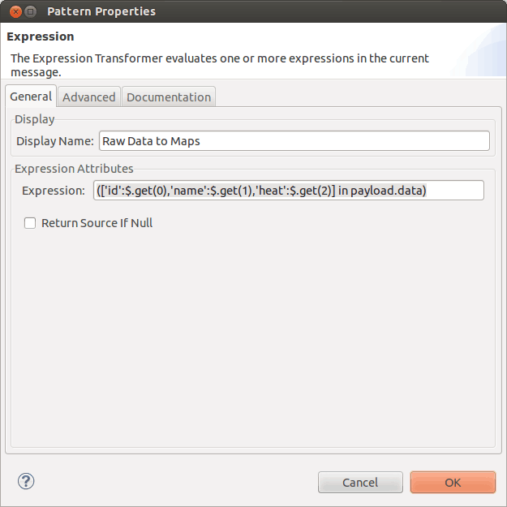
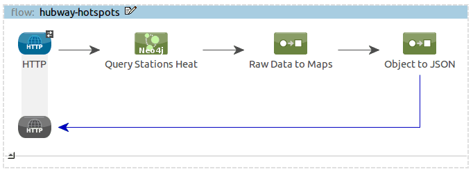

Mule has a very extensive support for [NoSQL](https://blogs.mulesoft.com/tag/nosql/) data stores, which covers pretty much the whole spectrum of what’s available out there, from key/value stores to document-oriented databases. The only piece that was missing in the puzzle was connectivity to a graph database: with the introduction of the Neo4j [connector](https://www.mulesoft.com/exchange#!/?types=connector), the gap is now closed.

Popularized by the advent of social [media](http://mulesoft.com/integration-solutions/soa/digital-media), the need for efficiently storing, indexing, traversing and querying graphs of objects has become prominent in less than a decade. During this time, [Neo4j](http://www.neo4j.org/) has risen to the number one graph database on the market, with successful deployments across all types of industries and a strong commitment to open source.

The new [connector](https://www.mulesoft.com/exchange#!/?types=connector), presented in this blog, allows Mule users to leverage the incredibly rich [API](http://www.mulesoft.com/platform/api) that Neo4j offers with convenient configuration elements. Read on to discover a simple example built with this [connector](https://www.mulesoft.com/exchange#!/?types=connector).

### Prerequisites

In order to follow this example you’ll need:

- A working installation of [Neo4j Community](http://www.neo4j.org/download),
- The [Neo4j Spatial Server plugin](https://github.com/neo4j/spatial#using-the-neo4j-spatial-server-plugin) installed in your Neo4j server,
- A working installation of a recent version of [Mule Studio](https://github.com/mulesoft/mule).

### Loading sample data in Neo4j

In this example, we will use the dataset that Neo4j made public for the [Hubway Data Challenge](http://blog.neo4j.org/2012/10/using-spring-data-neo4j-for-hubway-data.html) ([Hubway](http://www.thehubway.com/) is a bike sharing service which is currently expanding worldwide). We will expose a [Cypher query](http://www.neo4j.org/learn/cypher) as a basic HTTP resource: this query will let the caller retrieve the nearby Hubway stations and how “hot” they are (ie how much trips started or ended at these stations).

1. Download the dataset: [hubway_data_challenge_boston.zip](http://example-data.neo4j.org/files/hubway_data_challenge_boston.zip)
2. Stop your Neo4j server
3. In case you care, back-up your existing data, ie the `/path/to/neo/data` directory
4. Extract the zip file into `/path/to/neo/data/graph.db`
5. Start the server again
6. Browse the Neo4j dashboard and confirm you have ~500K nodes loaded as shown below:

[](https://blogs.mulesoft.com/wp-content/uploads/2013/06/neo4j-dashboard.png)

### Getting Mule Studio Ready

The Neo4j module doesn’t come bundled with [Mule Studio](http://www.mulesoft.com/platform/mule-studio) so we have to install it first. For this, we have to do the following:

1. Open [Mule Studio](http://www.mulesoft.com/platform/mule-studio) and from “Help” menu select “Install New Software…”. The installation dialog – shown below – opens.
2. From “Work with” drop down, select “[MuleStudio](http://www.mulesoft.com/platform/mule-studio) [Cloud Connectors](https://www.mulesoft.com/exchange#!/?types=connector)Update Site”. The list of available [connectors](https://www.mulesoft.com/exchange#!/?types=connector) will be shown to you.
3. Find and select the Neo4j module in the list of available [connectors](https://www.mulesoft.com/exchange#!/?types=connector).
4. When you are done selecting the Neo4j module, click on “Next” button. Installation details are shown on the next page. Click on “Next” button again and accept the terms of the license agreement.
5. Click on “Finish” button. The Neo4j module is downloaded and installed onto Studio. You’ll need to restart the Studio for the installation to be completed.

### Setting up the project

Now that we’ve got [Mule Studio](http://www.mulesoft.com/platform/mule-studio) up and running, it’s time to work on the Mule Application. Create a new Mule Project by clicking on “File > New > Mule Project”. In the new project dialog box, the only thing you are required to enter is the name of the project: use “neo4j-example” or similar. You can click on “Next” to go through the rest of pages.

The first thing to do in our new application is to configure the Neo4j [connector](https://www.mulesoft.com/exchange#!/?types=connector) to connect to our local server.

> *We assume that you have not added security (password protection) nor changed the default port it listens to.*

For this, in the message flow editor, click on “Global Elements” tab on the bottom of the page. Then click on “Create” button on the top right of the tab. In the “Choose Global Element” type dialog box that opens select “Neo4j” under “[Cloud Connectors](https://www.mulesoft.com/exchange#!/?types=connector)” and click OK. In the Neo4j configuration dialog box that follows, set the name to “Neo4j”.

[](https://blogs.mulesoft.com/wp-content/uploads/2013/06/studio-global-neo4j-config.png)

You are done with the configuration. Click “OK” to close the dialog box.

### Building the HTTP service flow

It’s time to start building the flow that will expose a Cypher query over HTTP ([learn more about the Cypher query language](http://www.neo4j.org/learn/cypher)).

Start by dropping an `HTTP` element on the visual editor and configure it as below:

[](https://blogs.mulesoft.com/wp-content/uploads/2013/06/studio-http-endpoint.png)

The Cypher query we want to run is the following:

```sql
START n=node:locations('withinDistance:[#[message.InboundProperties.lat],#[message.InboundProperties.lon], 0.5]')
MATCH (t)-[:`START`|END]->n
RETURN n.stationId, n.name, count(*)
ORDER BY count(*) DESC
```


This query selects the Hubway stations 500 meters or less from the coordinates provided via two HTTP query parameters (`lat` and `lon`, extracted with embedded MEL expressions), and sorts them according to the amount of the trips that started or ended there. This way, “hot” stations will come first in the list.

For this, drop one Neo4j element from the “[Cloud Connectors](https://www.mulesoft.com/exchange#!/?types=connector)” section of the Studio palette. Edit its properties as shown below:

[](https://blogs.mulesoft.com/wp-content/uploads/2013/06/studio-neo4j-query.png)

We want to return the results as a JSON array of objects, which will have the `id`, `name` and `heat` members. For this we use an expression transformer to build a list of maps that we will then serialize as JSON. This simple MEL projection performs the transformation: `(['id':$.get(0),'name':$.get(1),'heat':$.get(2)] in payload.data)` So drop an expression transformer in the flow, right after the Neo4j query element and configure it as shown below:

[](https://blogs.mulesoft.com/wp-content/uploads/2013/06/studio-raw-data-to-maps.png)

Finally, drop an “Object to JSON” transformer in flow, after the expression transformer. Your flow should look very much like this:

[](https://blogs.mulesoft.com/wp-content/uploads/2013/06/studio-full-flow.png)

Your full XML configuration should be very much like this one:

```xml
<?xml version="1.0" encoding="UTF-8"?>
<mule xmlns:json="http://www.mulesoft.org/schema/mule/json" xmlns:http="http://www.mulesoft.org/schema/mule/http"
    xmlns:neo4j="http://www.mulesoft.org/schema/mule/neo4j" xmlns:file="http://www.mulesoft.org/schema/mule/file"
    xmlns="http://www.mulesoft.org/schema/mule/core" xmlns:doc="http://www.mulesoft.org/schema/mule/documentation"
    xmlns:spring="http://www.springframework.org/schema/beans" version="EE-3.4.0"
    xmlns:xsi="http://www.w3.org/2001/XMLSchema-instance"
    xsi:schemaLocation="
        http://www.springframework.org/schema/beans http://www.springframework.org/schema/beans/spring-beans-current.xsd
        http://www.mulesoft.org/schema/mule/core http://www.mulesoft.org/schema/mule/core/current/mule.xsd
        http://www.mulesoft.org/schema/mule/neo4j http://www.mulesoft.org/schema/mule/neo4j/current/mule-neo4j.xsd
        http://www.mulesoft.org/schema/mule/file http://www.mulesoft.org/schema/mule/file/current/mule-file.xsd
        http://www.mulesoft.org/schema/mule/http http://www.mulesoft.org/schema/mule/http/current/mule-http.xsd
        http://www.mulesoft.org/schema/mule/json http://www.mulesoft.org/schema/mule/json/current/mule-json.xsd">


    <neo4j:config name="Neo4j" doc:name="Neo4j">
        <neo4j:connection-pooling-profile
            initialisationPolicy="INITIALISE_ONE" exhaustedAction="WHEN_EXHAUSTED_GROW" />
    </neo4j:config>


    <flow name="hubway-hotspots" doc:name="hubway-hotspots">
        <http:inbound-endpoint exchange-pattern="request-response"
            host="localhost" port="8081" path="hubway/hotspots" doc:name="HTTP" />
        <neo4j:run-cypher-query config-ref="Neo4j"
            query="START n=node:locations('withinDistance:[#[message.InboundProperties.lat],#[message.InboundProperties.lon], 0.5]')
MATCH (t)-[:`START`|END]-&gt;n
RETURN n.stationId, n.name, count(*)
ORDER BY count(*) DESC"
            doc:name="Query Stations Heat" />
        <expression-transformer
            expression="(['id':$.get(0),'name':$.get(1),'heat':$.get(2)] in payload.data)"
            doc:name="Raw Data to Maps" />
        <json:object-to-json-transformer doc:name="Object to JSON" />
    </flow>
</mule>
```

### Testing the application

Now it’s time to test the application. Run the application in [Mule Studio](http://www.mulesoft.com/platform/mule-studio) using `Run As &gt; Mule Application`.

Now browse to `http://localhost:8081/hubway/hotspots?lat=42.353412&amp;lon=-71.044624` in your favorite browser. You should see this JSON structure:

```json
[
    {
        "heat": 17529, 
        "id": 24, 
        "name": "Seaport Square - Seaport Blvd. at Boston Wharf"
    }, 
    {
        "heat": 12843, 
        "id": 64, 
        "name": "Congress / Sleeper"
    }, 
    {
        "heat": 7661, 
        "id": 7, 
        "name": "Fan Pier"
    }
]
```

This example covers only one operation of the Neo4j [connector](https://www.mulesoft.com/exchange#!/?types=connector), running a Cypher query. There are many more operations available that allow you to create, update and delete nodes and relationships, to traverse these relationships and run graph algorithms. Now that you’ve taken your first steps with this new [connector](https://www.mulesoft.com/exchange#!/?types=connector), go on and explore further the world of graph databases!